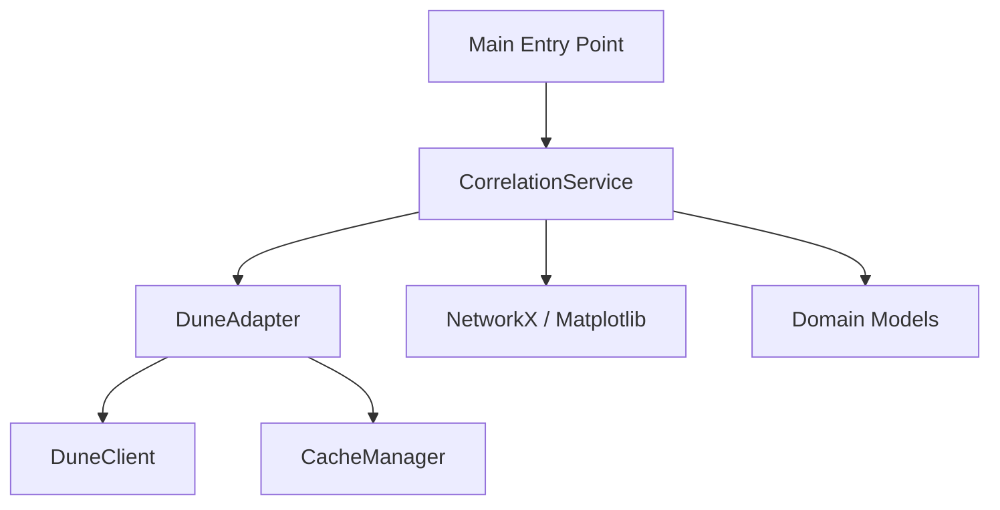

# Rapport d'Audit de Code et Analyse Architecturale
Type: Analyse Codebase (/analyse-codebase)
Date: 04 Février 2026

## 1. Résumé Exécutif

**Note Globale : 6.5/10**

Le projet présente une base saine avec une architecture modulaire claire et moderne (Clean Architecture "Lite"). Les technologies choisies (NetworkX, Pandas, Dune Client) sont pertinentes pour le problème posé.

Cependant, le cœur fonctionnel du projet — **le calcul du score de corrélation** — est actuellement à l'état de squelette (score hardcodé à 0.0). De plus, la stratégie de récupération des données (profondeur de 1 saut, limite hardcodée) limite fortement la capacité de l'outil à détecter des liens indirects, ce qui est pourtant l'essence d'une analyse de graphe.

## 2. Analyse Architecturale

L'architecture suit un modèle en couches classique, favorisant la séparation des responsabilités.

### Structure des Interactions

*   **Main:** Point d'entrée, orchestration simple.
*   **Domain:** Définit les structures de données (`Address`, `Transaction`).
*   **Infrastructure:** Gestion du cache (Pickle).
*   **Adapters:** Abstraction de la source de données (Dune Analytics).
*   **Services:** Cœur logique (Construction du graphe, Calcul de score).

### Points Forts
*   **Organisation Modulaire :** Bonne séparation (Domain, Services, Adapters).
*   **Typage :** Utilisation systématique des `type hints` et `dataclasses`.
*   **Outillage Moderne :** Utilisation de `uv` et structure `pyproject.toml`.
*   **Dune Integration :** L'approche SQL direct via Dune est puissante pour ce cas d'usage.

## 3. Observations Détaillées

### A. Problèmes Critiques (Urgence Haute)

1.  **Absence de Logique de Scoring (`src/services/correlation.py`)**
    *   **Problème :** La méthode `calculate_score` retourne toujours `0.0`.
    *   **Impact :** L'application ne remplit pas sa fonction principale.
    *   **Recommandation :** Implémenter un algorithme (ex: Jaccard Coefficient sur les voisins, Katz Centrality, ou simple détection de chemin pondéré).

2.  **Profondeur de Graphe Limitée (`src/adapters/dune.py`)**
    *   **Problème :** La requête SQL récupère uniquement les transactions directes des deux adresses cibles (`limit=5` par défaut).
    *   **Impact :** Impossible de détecter des liens indirects (A -> C -> B) si C n'est pas dans le top 5 des transactions directes.
    *   **Recommandation :** Augmenter la limite ou implémenter une recherche itérative (niveau 2).

3.  **Risque d'Injection SQL & Formatage (`src/adapters/dune.py`)**
    *   **Problème :** Injection directe de variables f-string : `WHERE ("from" = {address1} ...`.
    *   **Impact :** Risque d'erreur de syntaxe SQL si l'adresse n'est pas formatée exactement comme Dune l'attend (ex: guillemets manquants, format `0x` vs byte array).
    *   **Recommandation :** Utiliser le système de paramétrage de DuneClient si disponible, ou renforcer la gestion des guillemets/types.

### B. Dette Technique et Améliorations (Urgence Moyenne)

1.  **Logging via Print :** Utilisation massive de `print()` au lieu du module `logging`. Difficile à debugger en production ou lors de tests complexes.
2.  **Gestion des Erreurs :** `try/except Exception` génériques dans `main.py` et les adapters. Cela peut masquer des bugs spécifiques.
3.  **Sécurité du Cache :** Utilisation de `pickle` (`src/infrastructure/cache.py`). Bien que pratique en local, c'est un risque de sécurité si les fichiers de cache sont partagés ou altérés (exécution de code arbitraire).

### C. Code Mort / Inutilisé
*   Aucune quantité significative de code mort détectée à ce stade, le projet est concis.

## 4. Plan d'Action Recommandé

Voici les étapes priorisées pour faire passer le projet au niveau supérieur :

1.  **[Haute] Implémenter le Calcul de Score :**
    *   Dans `correlation.py`, remplacer le `0.0` par une logique réelle.
    *   *Suggestion Rapide :* Si `has_path` est vrai, score = 100. Sinon, calculer le % de voisins communs (Indice de Jaccard).

2.  **[Haute] Améliorer la Récupération de Données :**
    *   Augmenter `limit` dans `dune.py` (passer de 5 à 50 ou 100).
    *   Refactoriser la requête SQL pour s'assurer que les adresses sont correctement quotées (`'{address}'`).

3.  **[Moyenne] Affiner la Détection de Chemin :**
    *   Le graphe est orienté (`MultiDiGraph`). S'assurer que le concept de "lien" inclut aussi les chemins inverses ou passer en graphe non-orienté pour l'analyse de proximité simple.

4.  **[Basse] Mise en place de Logs :**
    *   Remplacer les `print()` par `logging.info()` et `logging.error()`.

**Conclusion :** Le squelette est excellent, il manque maintenant "le cerveau" de l'application (l'algo de scoring).
